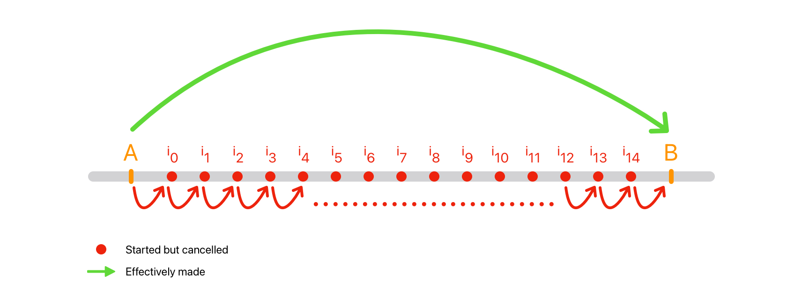
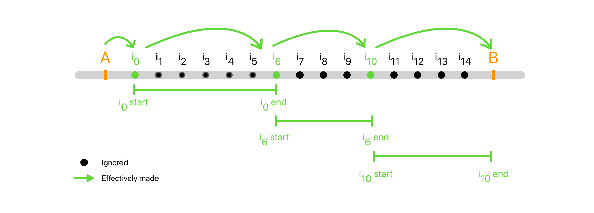

# AVPlayer seek improvement

## How AVPlayer's seek seems to work

During a seek using AVPlayer, moving from the position **A** to the position **B** will result in the passage of several intermediate positions, from **I<sub>0</sub>** to **I<sub>n</sub>**.
All intermediate **I** positions are cancelled. In other words, the move from **I<sub>0</sub>** to **I<sub>1</sub>** will take place and **I<sub>1</sub>** will cancel **I<sub>0</sub>**, the move from **I<sub>1</sub>** to **I<sub>2</sub>** will take place and **I<sub>2</sub>** will cancel the intermediate seek **I<sub>1</sub>**, and so on. In the end, all intermediate positions will be cancelled and the effective seek will be from position A to position B.



## Smooth Seeking

> Smooth Seeking, a concept introduced and term borrowed from the [Pillarbox project](https://github.com/SRGSSR/pillarbox-apple), offers a more advanced implementation than the one presented in this project.

The Smooth Seeking consists to ignore unnecessary intermediate seeks. When seeking from position **A** to position **B**, all intermediate positions will not be performed, some of them will be ignored. In other words, if we are on intermediate position **I<sub>0</sub>**, until position **I<sub>0</sub>** is completed, intermediate positions between **I<sub>0</sub>** and **I<sub>x</sub>** will be ignored.



## Demo


### Logs

```
Raw Player: 🔴🔴🔴🔴🔴🔴🔴🔴🔴🔴🔴🔴🔴🔴🔴🔴🔴🔴🔴🔴🔴🔴🔴🔴🔴🔴🔴🔴🔴🔴🔴🔴🔴🔴🔴🔴🔴🔴🔴🔴🔴🔴🔴🔴🔴🔴🔴🔴🔴🔴🔴🔴🔴🔴🔴🔴🔴🔴🔴🔴🔴🔴🔴🔴🔴🔴🔴🔴🔴🔴🔴🔴🔴🔴🔴🔴🔴🔴🔴🔴🔴🔴🔴🔴🔴🔴🔴🔴🔴🔴🔴🔴🔴🔴🔴🔴🔴🔴🔴🔴🔴🔴🔴🔴🔴🔴🔴🔴🔴🔴🔴🔴🔴🔴🔴🔴🔴🔴🔴🔴🔴🔴🔴🔴🔴🔴🔴🔴🔴🔴🔴🔴🔴🔴🔴🔴🔴🟢

Smooth Player: 🟢🟢🟢🟢🟢🟢🟢🟢🟢🟢🟢🟢
```